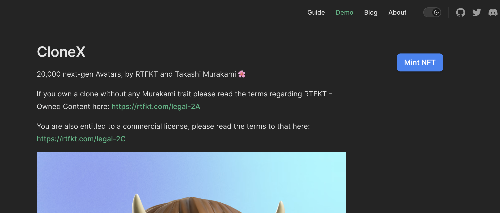

  

Web3VitePress
Vite & Vue Powered Web3 Static Site Generator

 

  <a href="https://web3-vite-press.vercel.app/">Live Demo</a>

 

## Features

- Your markdown pin on to IPFS: Pin your markdown docs on to IPFS with only one Button to Click.
- NFT as donation/support: Every post can be an ERC1155 NFT that web3 citizens can mint NFT to support you.
- With the power of FVM: The NFT contract publish on FVM, so that user can use FileCoin as payment
- Fully static yet still dynamic: Go wild with true SSG + SPA architecture. Static on page load, but engage users with 100% interactivity from there.

## Guide

<https://web3-vite-press.vercel.app/guide/>

## Mint NFT Demo URL

<https://web3-vite-press.vercel.app/demo-blog/clonex.html>

## Screenshot

