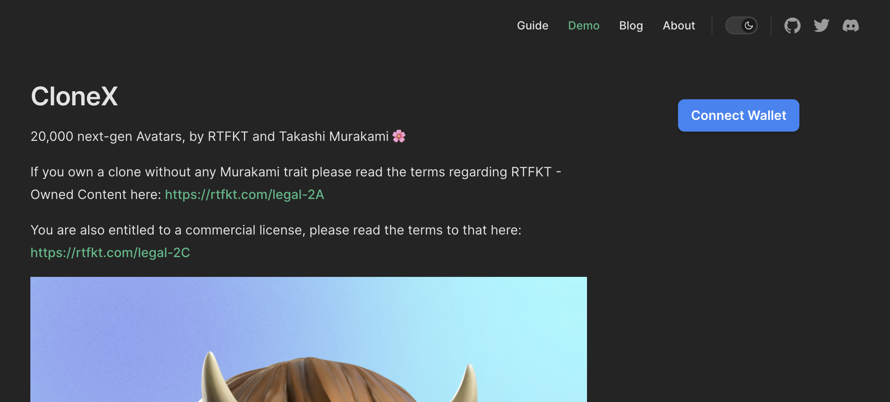
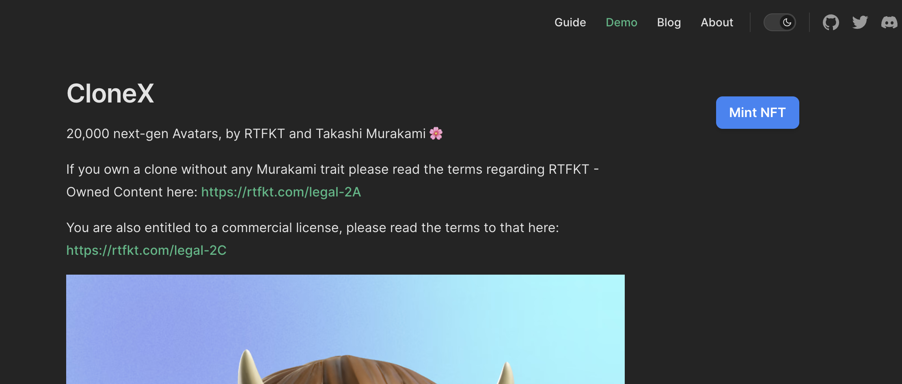
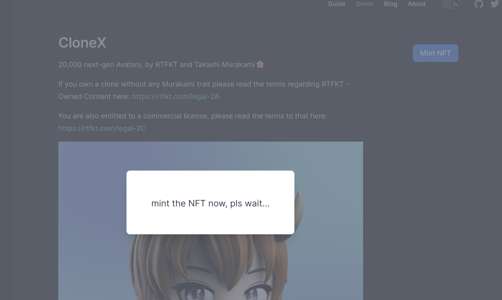
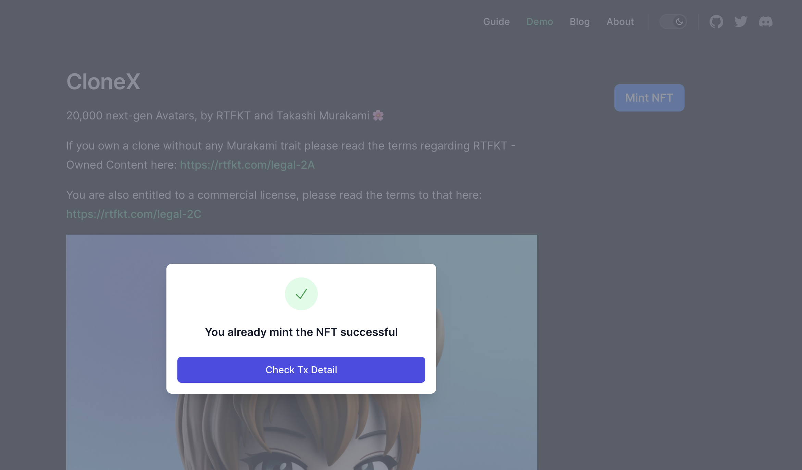

# Step 3: Mint your NFT in Action

Use this command to start your local site dev.

```sh
npm run dev
```

Navigate to your blog page, in our `CloneX` articl example, we go to the [`http://localhost:5173/demo-blog/clonex.html`](http://localhost:5173/demo-blog/clonex.html) page.

## 1. Connect wallet

First, you could see the `Connect Wallet` Button. Click on it to connect wallet first.



## 2. Mint NFT

After connect to the wallet, you should see the `Mint NFT` Button.



Click it will show a dialog with loading message, it should trigger metamask for you to confirm, pls confirm it and just wait for it to finish.



## 3. Mint success

After it mint success, you should see this.



Click on the `Check Tx Detail` button, you can see the tx detail on filfox.

Here is an example link I just make: <https://hyperspace.filfox.info/en/tx/0xa51181bfdc5f00130ded9e95c12ec42134d30f361ea82aa9ca5768aa49db9819>
